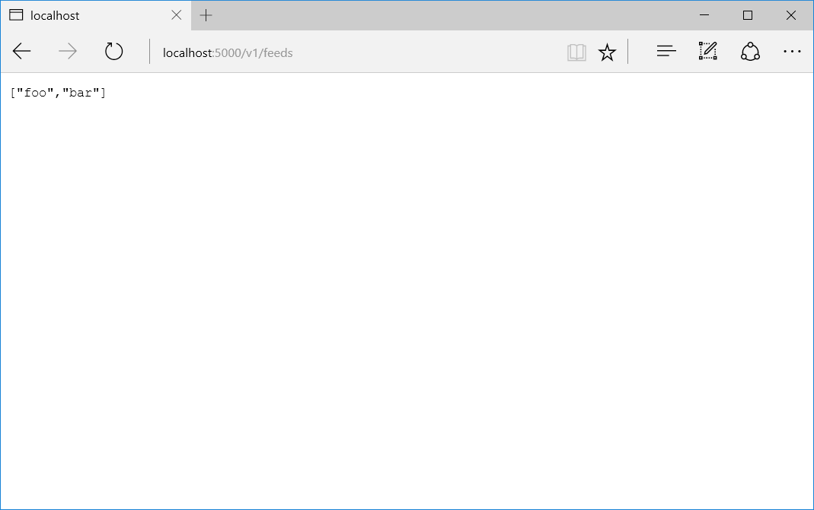

### .NET Memory Leak in Nancy app

In this lab, you will find a memory leak in [Nancy](https://github.com/NancyFx/Nancy/wiki/Introduction) app.

#### Task 1

Launch the WebApp.exe application from the [bin](bin/) folder. Navigate to [Feeds controller](http://localhost:5000/v1/feeds) in your browser. You should see server response.

#### Task 2

Open the WebAppBytesInAllHeaps.PerfmonCfg from the [bin](bin/) folder. The graph shows memory consumption by WebApp.exe. Run the [MakeRequests.bat](bin/MakeRequests.bat). This script sends requests to the Nancy instance.
After a minute you will see that memory consumption is growing, which clearly indicates a memory leak.

#### Task 3

Find and fix the memory leak.

#### Help
[Solution](Solution.md)