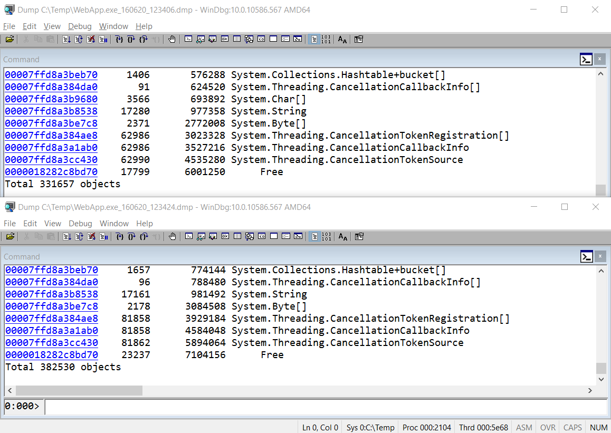
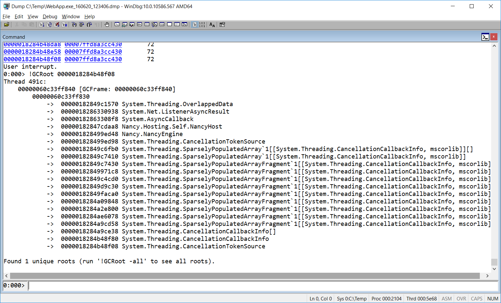

### Solution for Nancy memory leak

#### Task 1

Launch the WebApp.exe application from the [bin](bin/) folder. Run the [MakeRequests.bat](bin/MakeRequests.bat). Take 2 memory dumps a few seconds apart.

You can take memory dumps with a help of Task Manager or you can use procdump.exe from the [tools](../tools/) folder. 

`procdump -ma -n 2 -s 15 WebApp` this command creates 2 memory dumps of WebApp application 15 seconds apart.

#### Task 2

Open the first memory dump in WinDbg. Load SOS extension and print out managed heap statistics:
```
!loadby sos clr
!DumpHeap -stat
```
Now repeat these steps for the second dump and compare two tables.



From the image above we can make a conclusion that managed heap is growing. In the first dump we have 331 657 objects and in the second - 382 530.
Also in the second memory dump we have on 30% more `CancellationTokenSource` objects than in the first memory dump. It looks like `CancellationTokenSource` is responsible for the memory leak.

Keep in mind that we don't need to compare all rows, because fat objects at the bottom of each table.

#### Task 3

It's time to find GC roots for `CancellationTokenSource` objects. In order to display all instances of `CancellationTokenSource` type you should pass Method Table pointer to the `!DumpHeap` command.
```
!DumpHeap /d -mt 00007ffd8a3cc430
```
> Note: Ctlr+PauseBreak interrupts long operation in WinDbg.

`!GCRoot 0000018284b48f08` prints out root for the specified object. Call `GCRoot` for a few objects.


#### Task 4

Now we know that `CancellationTokenSource` holds the most of memory of the app and `Nancy.NancyEngine` holds references to the almost all instances of `CancellationTokenSource`.
Find [NancyEngine](https://github.com/shchahrykovich/diagnostics-courses/blob/master/case-nancy-memory-leak/src/Nancy-1.4.1/Nancy/NancyEngine.cs) in the source code.
On the [line 98](https://github.com/shchahrykovich/diagnostics-courses/blob/master/case-nancy-memory-leak/src/Nancy-1.4.1/Nancy/NancyEngine.cs#L98) a new linked cancellation token is created, but there is no Dispose.
In order to fix the bug we have to call Dispose on `cts` variable.
```
 var cts = CancellationTokenSource.CreateLinkedTokenSource(this.engineDisposedCts.Token, cancellationToken);
```
Wrap `cts` in `using` and verify the fix.

### References
[Hidden catch when using linked CancellationTokenSource](https://lowleveldesign.wordpress.com/2015/11/30/catch-in-cancellationtokensource)

[Github changeset](https://github.com/NancyFx/Nancy/commit/7d70fed4c1dbd9bd530564c4e06a178ed2e19ef6)